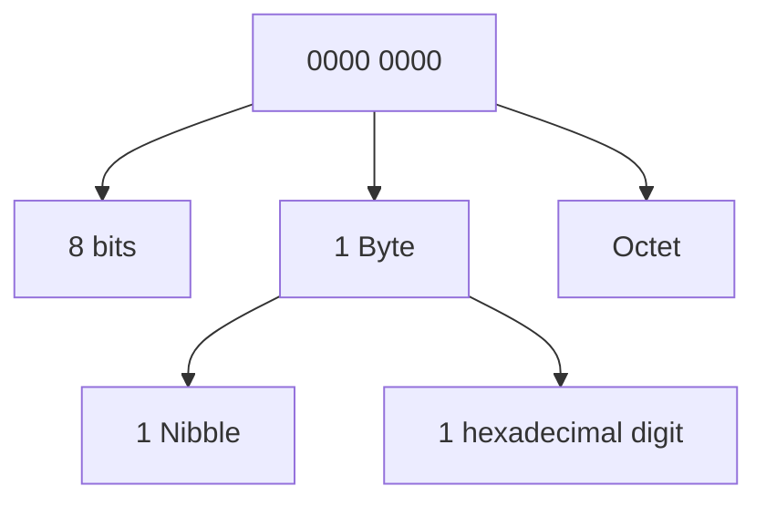

```mermaid
flowchart TD
	A[0000 0000] --> B[8 bits]
	A --> C[1 Byte]
	A --> D[Octet]
	C --> E[1 Nibble]
	C --> F[1 hexadecimal digit]
```

8-bit: 255
16-bit: 65,536
32-bit: 2,147,483,647
64-bit: 9,223,372,036,854,775,807