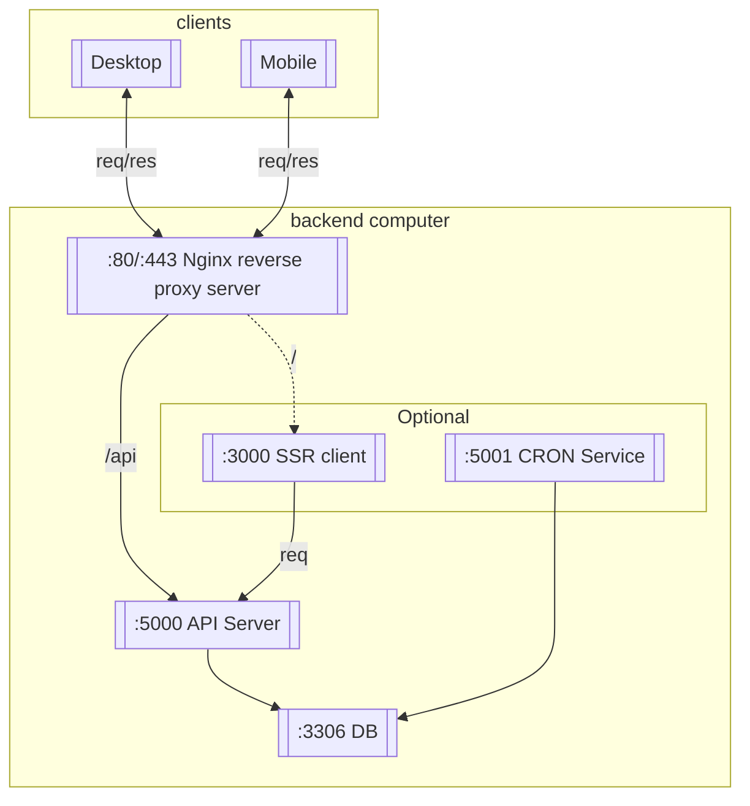
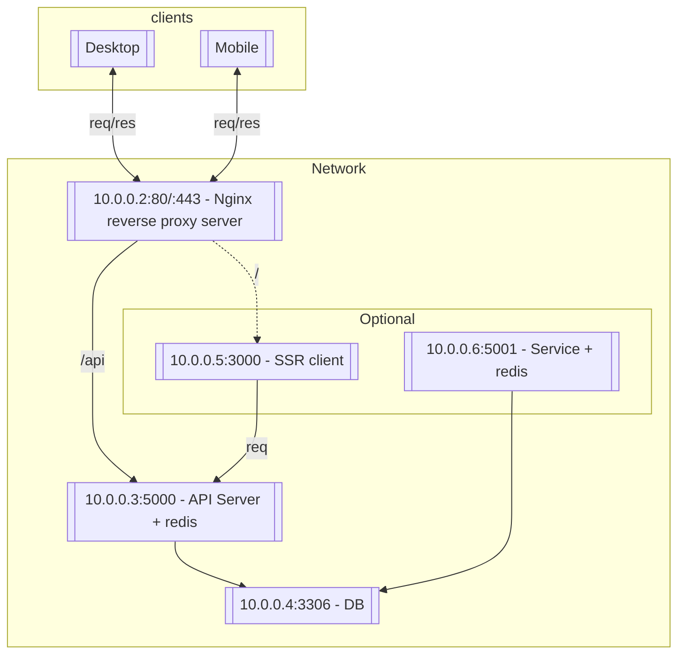
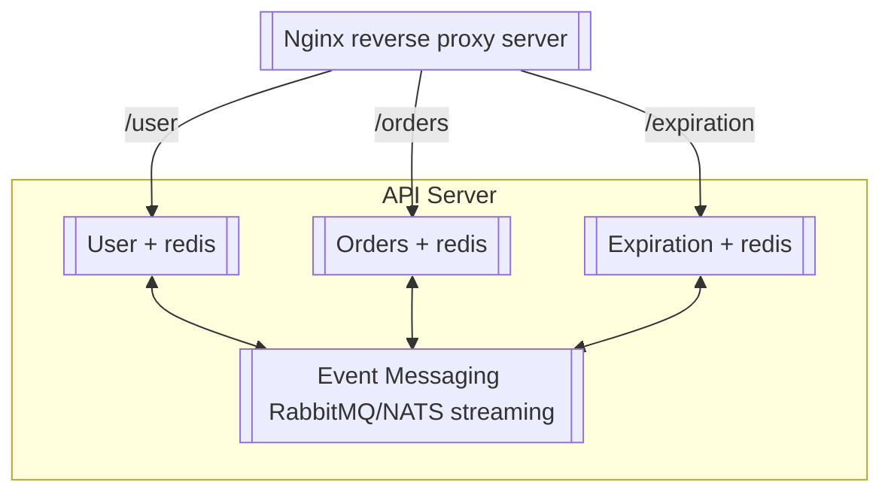

Before we begin, please correct me if there is any misinformation in this article.

The article assumes you have some knowledge regarding domains, ports, HTTP, etc. Feel free to ask in the comment section below if you're missing something. 

Let's begin.

Backend servers are hosted in a single computer like a monolith in the old days. This means that the DB, the API, and other services are in one computer and share the RAM and the disk drive. Here's a general diagram of how almost all web servers are architectured:

This is your usual setup at home. 

While it will work as intended, the scalability aspect of it could be better as all the services share the computer's resources.

Then, services started having their own host machine - utilizing the network more. Something like this:

Thanks to Nginx's load-balancing capabilities, every application can scale horizontally on demand. 

Additionally, every service can have an independent caching layer via Redis, drastically improving performance.

The \[API server + redis\] service can even be broken down to microservice architecture something like this:

It's hard to have dedicated services when starting out but this is where docker really shines.

Okay, what is Docker? Docker is a platform designed to help developers build, share, and run modern applications. It utilizes OS-level virtualization to deliver software in packages called containers (via google). 

With docker, you can easily have a dedicated service which code running on a specific image. This eliminates the "it runs on my machine" problem as well!

